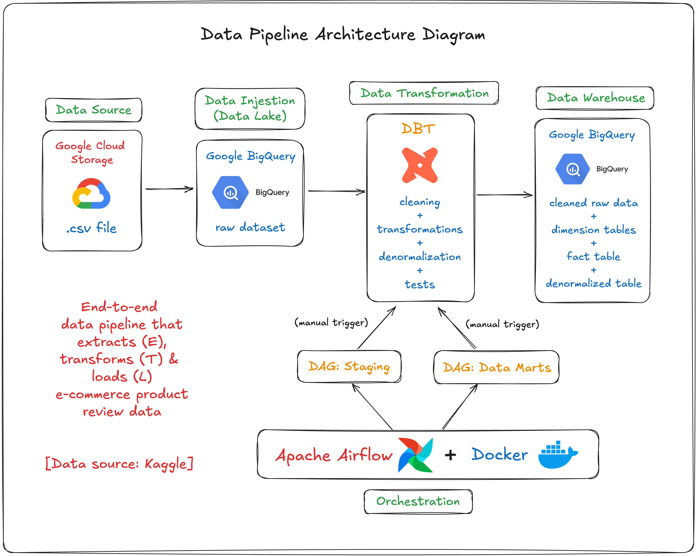

# Data Pipeline Project: DBT + Airflow + Google BigQuery

This project is part of an end-to-end data pipeline that processes and transforms e-commerce product review data. It extracts structured insights from a raw dataset stored in Google Cloud Storage (GCS) and loads cleaned, modeled tables into Google BigQuery for analytics.

The pipeline uses a modular dbt architecture, with separation between staging, dimensional modeling, fact generation, and denormalization. Apache Airflow is used for orchestration, ensuring reliable and maintainable workflows.

## Data Pipeline Architecture & Flow

### **Data Source**
- The raw dataset used in this pipeline was sourced from Kaggle, containing e-commerce product reviews.
- This dataset serves as the foundation for all transformations and modeling in the project.

### 1. **Ingestion**
- A static `.csv` file containing product reviews is uploaded to **Google Cloud Storage (GCS)**.
- This file serves as the **raw data source**.

### 2. **Transformation (DBT)**
The pipeline consists of multiple layers of transformation:
  - **Staging models**: Clean and prepare the raw data
  - **Dimensional models**: Create dimension tables:
    - `dim_products`
    - `dim_users`
    - `dim_reviews_metadata`
  - **Fact model**: Create `fact_reviews` containing transactional review data
  - **Denormalized model**: Final wide table `fact_dim_denormalized` with joins for easy analysis

### 3. **Loading**
- All transformed tables are materialized in **Google BigQuery**.
- Denormalized table is optimized for dashboarding/reporting use cases.

### 4. **Testing**
This project emphasizes data quality through a combination of:

- Built-in dbt tests (unique, not_null, accepted_values) are defined in `schema.yml` and `source.yml`.
- Custom tests leverage the `metaplane/dbt_expectations` package for expressive assertions and enhanced data validation.

### 5. **Orchestration (Airflow)**
The pipeline is orchestrated using two separate Airflow DAGs to modularize and organize the workflow:

**DAG 1: Staging Pipeline**

- Handles data ingestion and staging tasks, including loading raw data from Google Cloud Storage into staging tables in BigQuery. This prepares the data for further transformation.
 

**DAG 2: Mart Creation Pipeline**

- Handles transformation of staged data into dimensional models (dim tables), fact tables, and denormalized marts using dbt models. This DAG builds the final analytics-ready tables in BigQuery.

Both DAGs are currently triggered manually with plans to enable automated scheduling and monitoring.

 

## Tables in BigQuery

| Table Name            | Type          | Description                                      |
|-----------------------|---------------|--------------------------------------------------|
| `stg_validated_data`  | Staging       | Cleaned raw data                                 |
| `dim_products`        | Dimension     | Product metadata (unique by product_id)          |
| `dim_users`           | Dimension     | User metadata (unique by user_id)                |
| `dim_reviews_metadata`| Dimension     | Review titles/content (unique by review_id)      |
| `fact_reviews`        | Fact          | Transactional review data                        |
| `fact_dim_denormalized`| Denormalized | Wide table with product, user, and review info   |

 

## How to Run the Pipeline

### Steps: ###
1. **Upload raw data** to your GCS bucket.
2. **Trigger Airflow DAG** (manually for now).
3. DAG runs the following in order:
   - Ingests raw data
   - Runs dbt models to transform and load data
4. **Tables available in BigQuery** for analysis.

 
 
## Future Enhancements

- Add Airflow scheduling and retry logic
- Add data quality tests using dbt
- Integrate a BI tool (e.g., Looker Studio) for reporting
- Automate raw data uploads via APIs or scheduled jobs

 

## Author

**Nishtha Pant**  
Early-career software & data engineer with a passion for building scalable data solutions and leveraging cloud + AI tools for smart insights.

